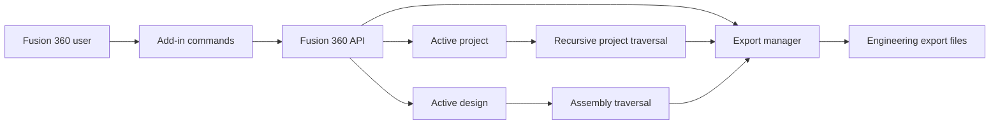
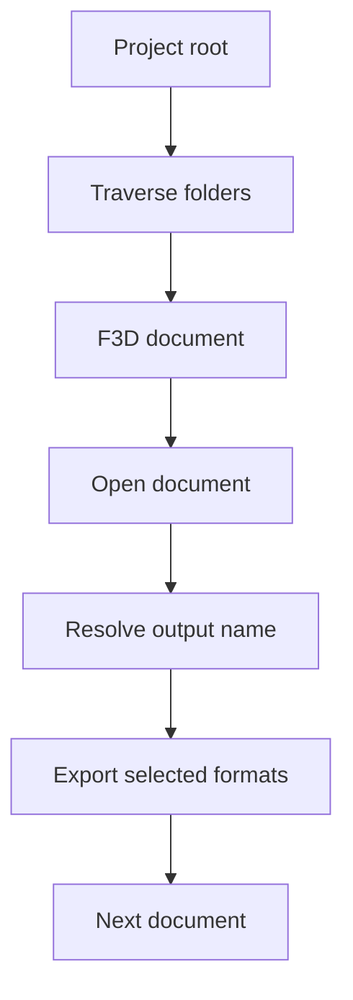

# My360Export

Autodesk Fusion 360 add-in for exporting projects, designs and components to multiple engineering file formats.


## Overview

My360Export automates repetitive export tasks inside Fusion 360.

The add-in can:

- export all Fusion documents in the active project
- recursively traverse project folders
- preserve project folder structure
- export the current design
- export top-level design components separately
- inspect the current assembly hierarchy
- close opened documents after batch operations
- choose output naming from document name, description or part number
- export multiple CAD formats

## Supported formats

The current implementation supports:

- IGES
- STEP
- SAT
- SMT
- F3D
- STL

## Architecture



See [docs/architecture.md](docs/architecture.md) for the detailed view.

## Main workflows

### Export active project



The export can optionally preserve the Fusion project folder hierarchy.

### Export current design

The current design can be exported as a complete design or as separate top-level components.

Output files are grouped by format.

### Inspect assembly structure

The design-info command recursively walks the active assembly and writes a tree representation to the Fusion Text Commands palette.

## Installation

Fusion 360 add-ins are installed through the standard Autodesk add-in mechanism.

The add-in directory is:

```text
my360export/
```

After installation, restart Fusion 360 or reload the add-in from the Scripts and Add-Ins dialog.

Because Fusion 360 and its Python API evolve over time, compatibility with current Fusion releases should be validated before relying on the add-in in production workflows.

## Repository structure

```text
my360export/
|-- .github/
|   `-- workflows/
|       `-- ci.yml
|-- docs/
|   |-- architecture.md
|   `-- provenance.md
|-- dist/
|   `-- historical packaged releases
|-- my360export/
|   |-- commands/
|   |-- config.py
|   |-- my360export.py
|   |-- startup.py
|   `-- my360export.manifest
|-- CHANGELOG.md
|-- CONTRIBUTING.md
|-- LICENSE
`-- README.md
```

## Historical distribution files

The repository still contains older ZIP packages under `dist/`.

These are preserved as historical artifacts.

Future packaged versions should preferably be distributed through GitHub Releases rather than committed directly to Git.

## Provenance and attribution

My360Export was developed by **Iván Rodríguez-Méndez** in 2022 from an earlier Fusion 360 add-in lineage.

The original version is credited in the source to **Patrick Rainsberry**.

Some adapted source files retain the original copyright headers, and those credits are intentionally preserved.

See [docs/provenance.md](docs/provenance.md) for details.

## Testing and validation

Most functional behavior depends on the Fusion 360 runtime and Autodesk `adsk` APIs.

CI therefore performs Python syntax validation only.

Changes that affect export behavior should be validated manually inside Fusion 360 against representative projects and designs.

## Current status

This repository is maintained primarily as an engineering utility and historical Fusion 360 add-in.

The code has not yet been fully modernized against current Fusion 360 API versions.

## Development workflow

Maintenance follows GitFlow.

See [CONTRIBUTING.md](CONTRIBUTING.md).

## License

Licensed under the Apache License 2.0. See [LICENSE](LICENSE).

This corrects an older README reference to the MIT License; the tracked LICENSE file and source headers identify Apache 2.0.
