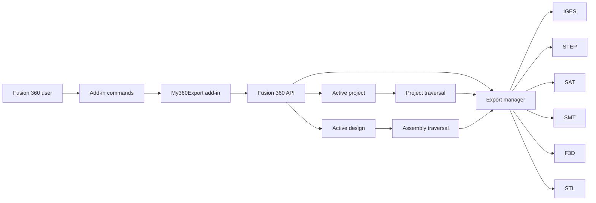
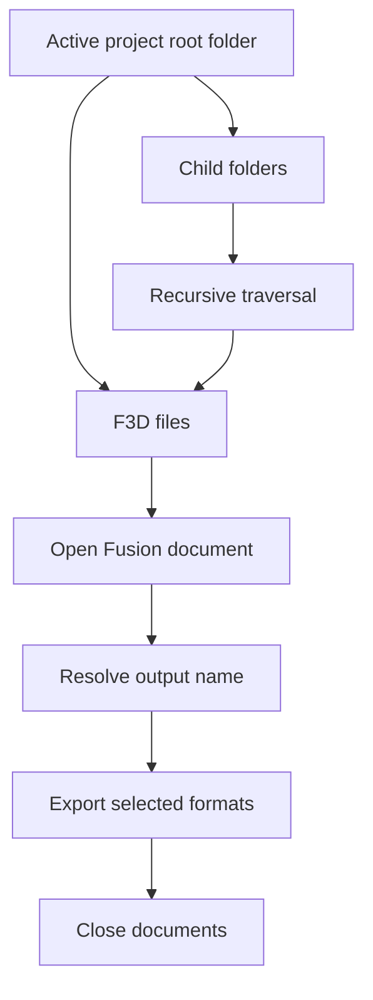
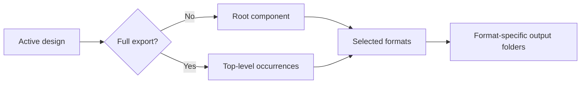

# Architecture

## Overview

My360Export is an Autodesk Fusion 360 add-in that automates export workflows for projects, designs and components.

The add-in runs inside Fusion 360 and uses the Autodesk Fusion API through the `adsk` modules.

## Add-in registration

`my360export/my360export.py` is the main Fusion 360 entry point.

It registers the available commands with the add-in framework:

- Export Active Project
- Close All Docs
- Get Current Design Info
- Export all elements from the current design

The add-in uses the `apper` helper framework to simplify Fusion 360 command registration and lifecycle handling.

## Project export

The project export workflow recursively walks the active Fusion project.

Exported file names can be based on:

- document name
- component description
- part number

Folder structure can optionally be preserved.

## Current design export

The current design command can export either:

- the root design
- each top-level occurrence separately

The output is grouped by export format.

## Supported export formats

The current implementation maps Fusion export-manager functions to:

- IGES
- STEP
- SAT
- SMT
- F3D
- STL

## Design inspection

`GetCurrentDesignInfoCommand.py` traverses the assembly hierarchy and writes a tree-like representation to the Fusion Text Commands palette.

This is useful for understanding the structure of a design before export.

## Fusion 360 boundary

Most of the code depends directly on:

- `adsk.core`
- `adsk.fusion`
- `adsk.cam`
- Fusion document and project objects
- Fusion export manager APIs

As a result, meaningful functional tests require the Fusion 360 runtime.

The repository CI therefore focuses on static Python syntax validation rather than pretending to execute the add-in outside Fusion.

## Provenance

The project was developed by Iván Rodríguez-Méndez from an existing Fusion 360 add-in lineage originally associated with Patrick Rainsberry.

Some source files retain original Patrick Rainsberry copyright headers, while later files explicitly identify Iván Rodríguez-Méndez as author and credit the original version.

Those credits are intentionally preserved.

See [provenance.md](provenance.md) for details.
